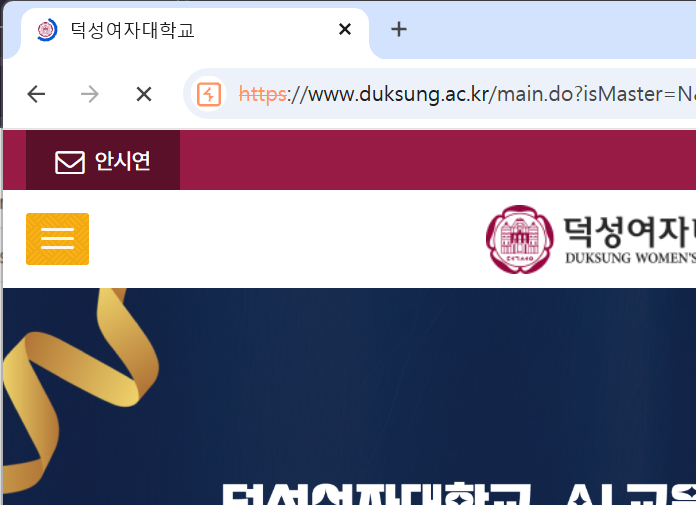

#과제 제출 형식 : 노션 기초반 페이지 과제 안내 확인 후 풀이 과정과 사진 첨부하여 제출 
## 과제 제출 기한 : 수요일 자정까지

<버프 스위트를 활용하여 학교 홈페이지 아무 곳에나 이름 적기>

1. Burp Suite 설정에서 Request/Response interception rules 설정 확인
2. Proxy에서 Open Browser로 브라우저 열기
3. 열린 브라우저를 통해 학교 홈페이지 접속
4. Intercept On 클릭 후 새로고침 -> 요청 패킷
5. Forward -> 응답 패킷
6. 응답 패킷의 HTML 코드에서 수정하고 싶은 부분 검색 후 바꾸기
7. 바꾼 후 Forward, Intercept Off