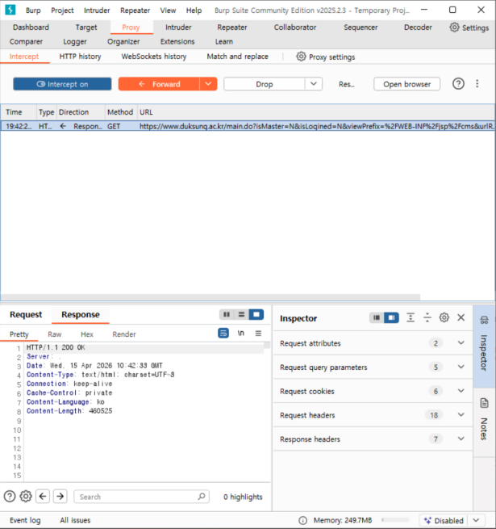
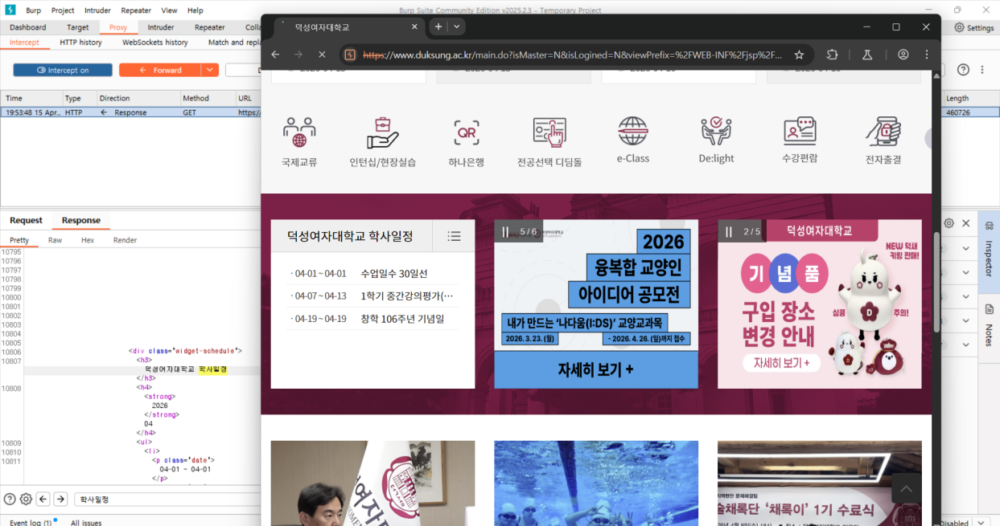
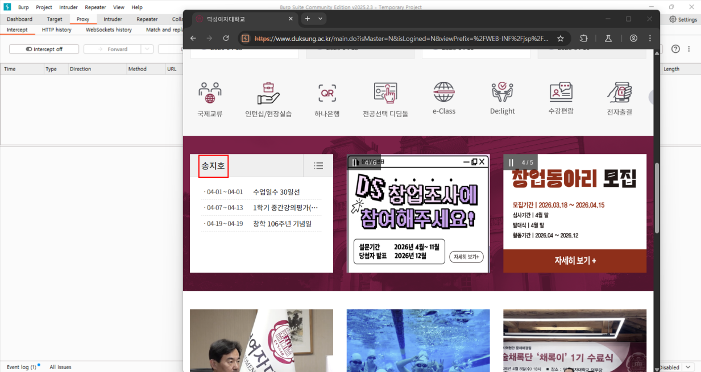

1. Burp suit 실행
2. Open browser 실행
3. 브라우저에서 duksung 검색
4. 학교 홈페이지 접속
5. intercept off->intercept on으로 변경
6. 요청 패킷 잡기
7. fotward 클릭
8. 잡힌 응답 패킷의 html 코드 확인
9. '덕성여자대학교 학사일정'을 '송지호'로 변경
10. forward 클릭 후 intercept off
11. '덕성여자대학교 학사일정'이 '송지호'로 바뀐 것을 확인할 수 있음
12. 과제 완료

### jiho test

