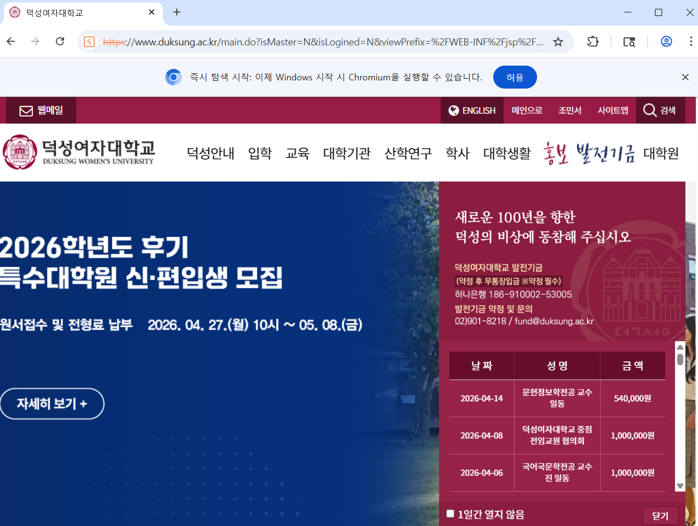

#과제 제출 형식 : 노션 기초반 페이지 과제 안내 확인 후 풀이 과정과 사진 첨부하여 제출 
## 과제 제출 기한 : 수요일 자정까지
# Burp Suite를 활용한 응답 패킷 변조 실습

## 1. Proxy 설정에서 응답 가로채기 설정
Burp Suite의 Proxy 설정에서 서버로부터 전달되는 응답(Response) 패킷도 가로챌 수 있도록 설정하였다.  
이를 통해 클라이언트에게 전달되기 전에 HTML 내용을 수정할 수 있다.

---

## 2. Open Browser를 통해 웹사이트 접속
Burp Suite의 Open Browser 기능을 사용하여 프록시가 적용된 브라우저를 실행하였다.  
이후 덕성여자대학교 홈페이지에 접속하였다.

---

## 3. Intercept ON 후 요청 패킷 가로채기
Proxy 탭에서 Intercept를 ON 상태로 설정한 뒤, 웹페이지를 새로고침하였다.  
이 과정에서 클라이언트에서 서버로 전달되는 요청(Request) 패킷이 Burp Suite에 의해 가로채졌다.

---

## 4. Forward를 통해 응답 패킷 확인
요청 패킷을 Forward 버튼을 눌러 서버로 전송한 후,  
서버에서 클라이언트로 전달되는 응답(Response) 패킷이 Burp Suite에 의해 가로채지는 것을 확인하였다.

---

## 5. HTML 코드 변조
가로챈 응답 패킷의 HTML 코드에서 로그인 영역의 텍스트를 찾아 "조민서"로 수정하였다.  

예시:
- 기존: 로그인
- 변경: 조민서  

이와 같이 HTML의 특정 부분을 수정함으로써 사용자에게 보여지는 웹페이지 내용을 변경할 수 있다.

---

## 6. 결과 확인
수정된 응답 패킷을 Forward로 전송한 후 Intercept를 OFF로 변경하였다.  
그 결과, 브라우저 화면에서 기존 로그인 영역이 "조민서"로 변경된 것을 확인할 수 있었다.

---

## 결과 화면

---

## 결론
본 실습을 통해 Burp Suite를 활용하여 네트워크 중간에서 응답 데이터를 수정함으로써,  
웹페이지에 표시되는 내용을 변경할 수 있음을 확인하였다.