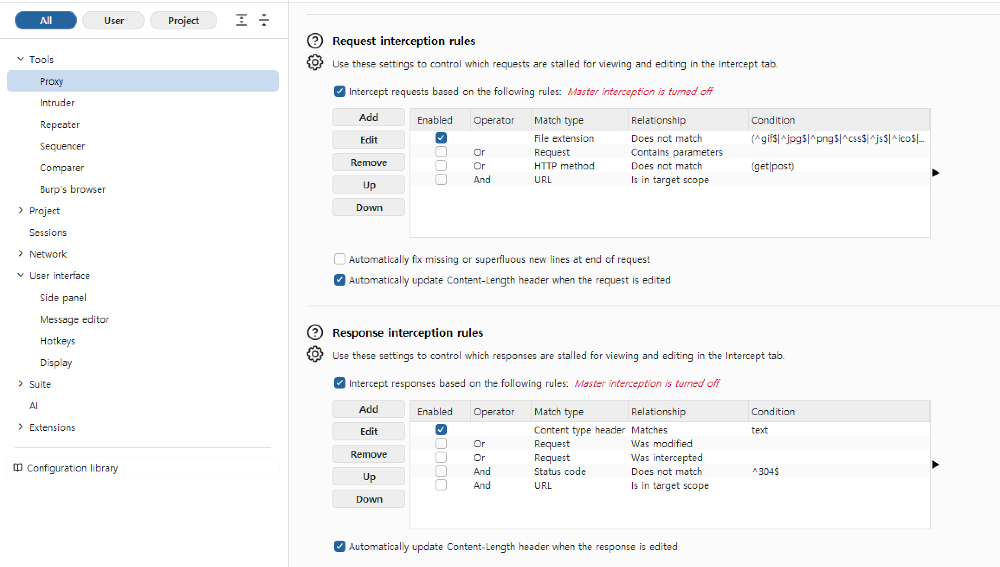
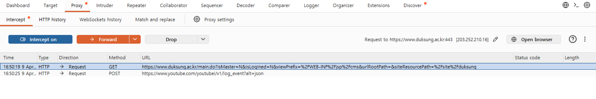
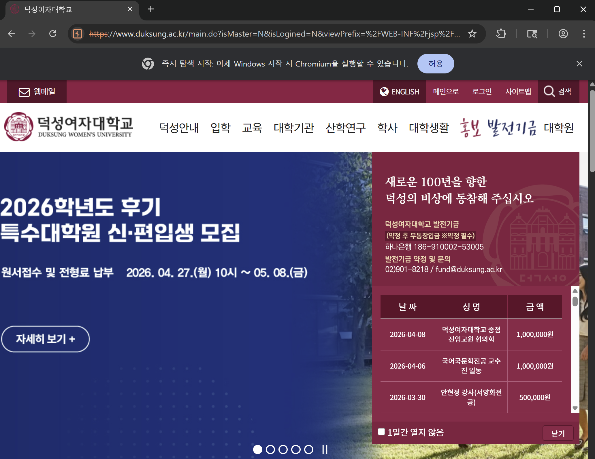
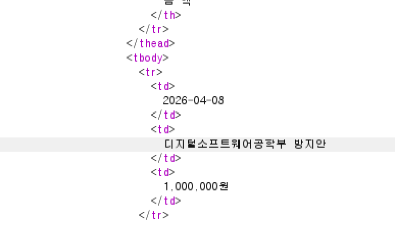
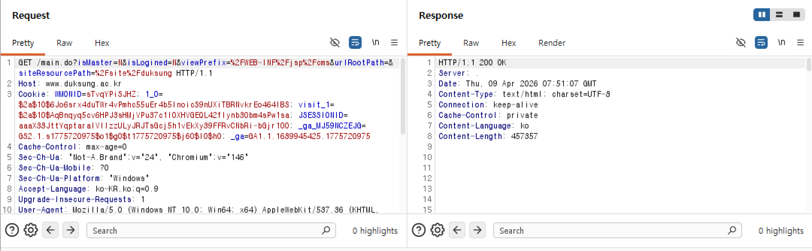
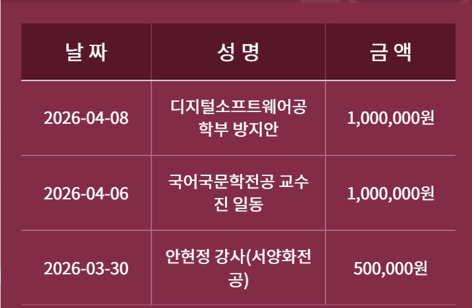

# 웹 보안 실습

## Burp Suite 툴을 사용한 서버 응답 변조

> `Proxy Settings` 에서 응답도 가로챌 수 있도록 `Response interception rules`도 설정해준다.
> 

> `Intercept Off` 상태로 브라우저를 열어 덕성여자대학교 홈페이지에 들어가줬다.
> 

> 다시 버프 스윗으로 돌아와 `Intercept On` 상태로 만들어주고, 홈페이지를 새로고침해주면 요청이 들어와있는 것을 확인할 수 있다.
> 

> `Forward` 탭을 클릭하면 `Response`도 확인할 수가 있는데, 이 HTML 코드에서 일부분을 수정해 교내 홈페이지에 내 이름이 들어갈 수 있도록 수정해보겠다.
> 

> HTML 코드가 방대하기 때문에, `Response` 탭 하단에 있는 `search` 도구를 활용해 내가 수정하고 싶은 코드를 찾아줬다. 내가 수정할 코드는 기부금 명단이다. 돈 많아 보이게 최상단에 위치하신 분의 이름을 내 이름으로 바꿔치기했다.
> 

> 코드 변조 후 다시 `Forward` → `Intercept Off` 버튼을 누르고, 브라우저로 열어뒀던 홈페이지를 확인해보면 내가 백만원 기부자가 되어있는 것을 확인할 수 있다.
>