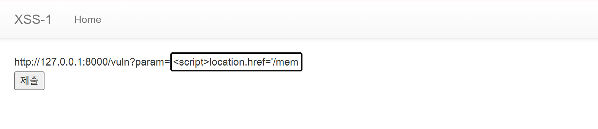
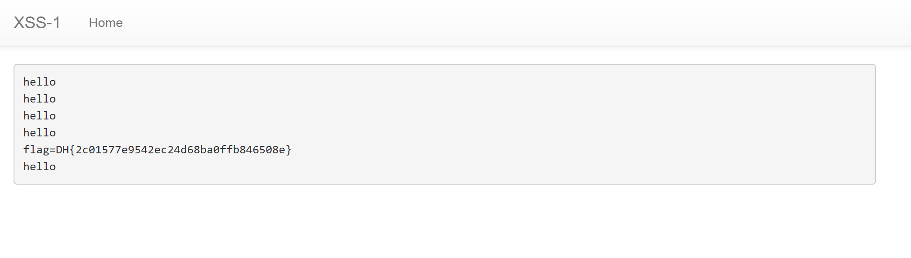
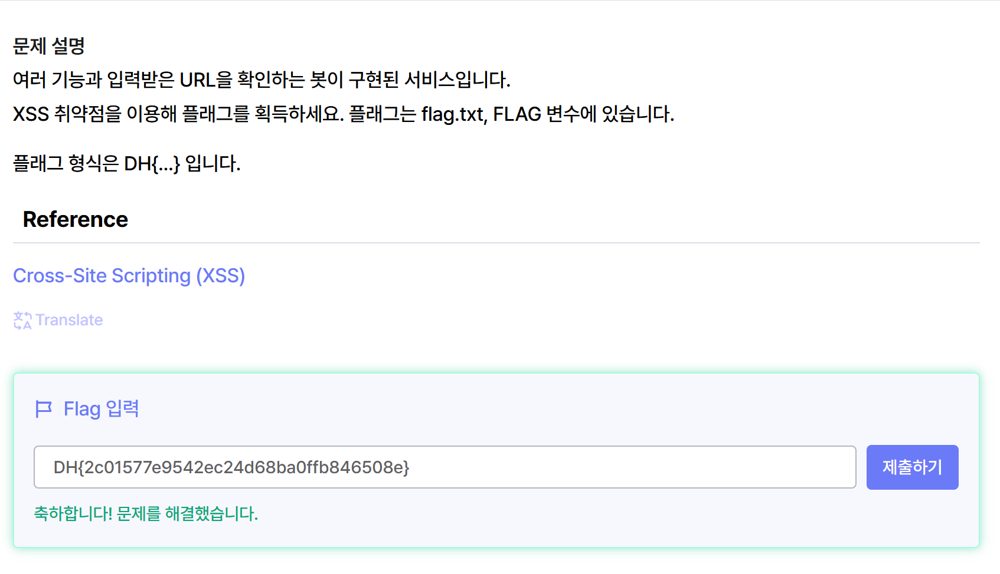

# week05 과제

## 사전 지식

## XSS란? 
XSS는 공격자가 웹 페이지에 악성 스크립트를 삽입하여, 다른 사용자의 브라우저에서 해당 스크립트가 실행되게 만드는 취약점이다. 서버가 아닌 클라이언트(브라우저) 측에서 공격이 발생한다는 점이 핵심이다.

1. Stored XSS (저장형)
악성 스크립트가 DB에 저장되어, 페이지를 방문하는 모든 사용자에게 실행된다. 한 번 심으면 불특정 다수에게 영향을 주므로 매우 위험하다. 

2. Reflected XSS (반사형)
악성 스크립트가 URL 파라미터에 담겨 서버에서 그대로 응답된다. 피해자가 링크를 클릭하는 순간 실행되며 피싱 메일 등에서 활용된다.

3. DOM-based XSS
서버를 거치지 않고, 브라우저의 DOM 조작 과정에서 발생한다. 서버 로그에 흔적이 남지 않아 탐지가 어렵다.

## XSS 공격 결과
(1)세션 탈취: document.cookie를 빼내어 계정 탈취

(2)키로깅: 사용자 입력(아이디/비번) 가로채기

(3)페이지 변조: 화면을 피싱 페이지로 교체

(4)내부망 스캔: 브라우저를 통해 내부 서비스 탐색

(5)CSRF 유발: 사용자 권한으로 요청 위조

## 대응 방안 
(1)출력 시 HTML 인코딩: 사용자 입력을 화면에 출력할 때 특수문자를 이스케이프한다.

(2)innerHTML 대신 textContent 사용

(3)CSP 헤더 설정: 브라우저가 허가된 출처의 스크립트만 실행하도록 제한한다.

(4)HttpOnly 쿠키 설정: 스크립트가 쿠키를 읽지 못하도록 막아, 세션 탈취 피해를 줄인다.

(5)입력값 검증 (Whitelist 방식): 허용할 문자/형식을 명확히 정의하고 그 외는 거부한다.

## 워게임 

(1) 취약점 분석
문제의 vuln 페이지는 사용자가 입력한 param 값을 그대로 출력한다. 예를 들어 를 입력하면 브라우저는 이를 단순한 문자열이 아닌 JavaScript 코드로 인식하여 실행한다. 즉, 사용자가 입력한 스크립트가 브라우저에서 실행되는 XSS 취약점이 존재한다.

(2) 플래그 획득
문제 설명에 따르면 플래그는 봇의 쿠키에 저장되어 있다. JavaScript에서는 document.cookie를 이용하여 현재 브라우저의 쿠키를 읽을 수 있다. 따라서 쿠키 값을 /memo 페이지에 저장하기 위해 와 같은 페이로드를 사용한다. 

이를 실행하면, 봇이 XSS 페이로드가 포함된 페이지에 접속하고 JavaScript가 실행된다.document.cookie를 통해 봇의 쿠키를 읽은 후 /memo?memo=쿠키값으로 이동하면 쿠키 값이 메모에 저장된다. 따라서 memo 페이지를 확인하여 플래그를 획득할 수 있다. 

