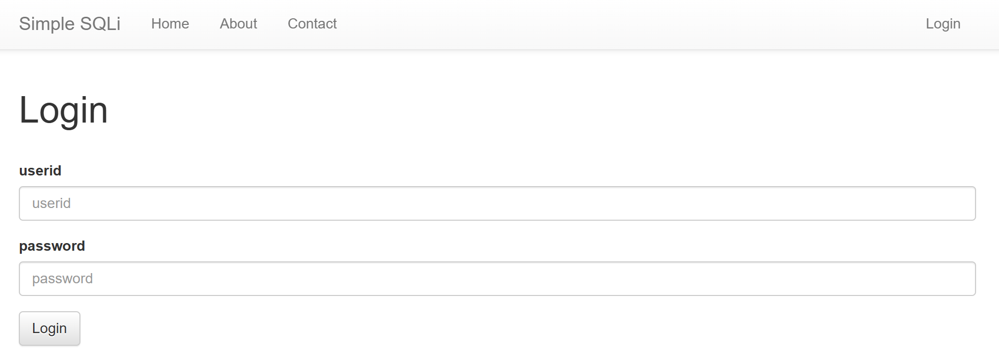
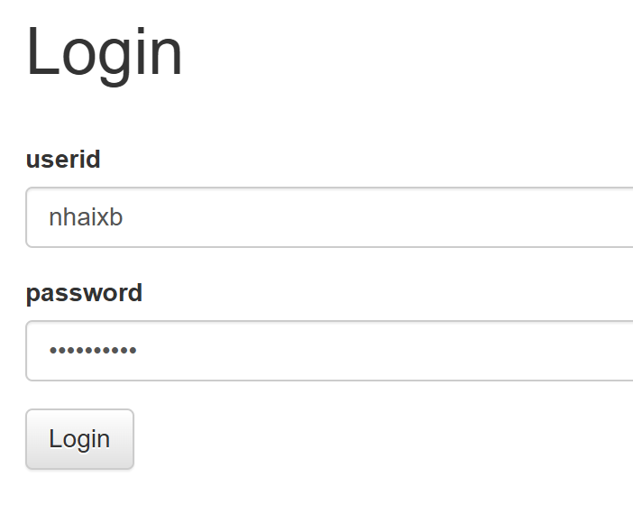
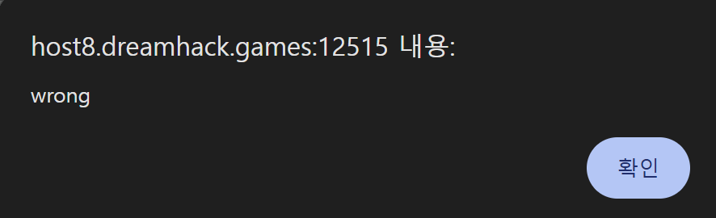
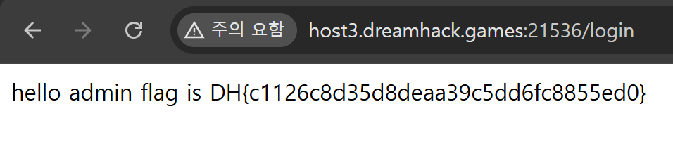
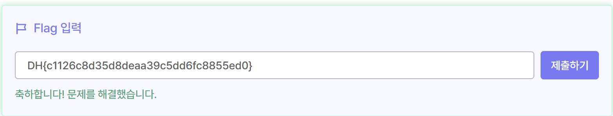
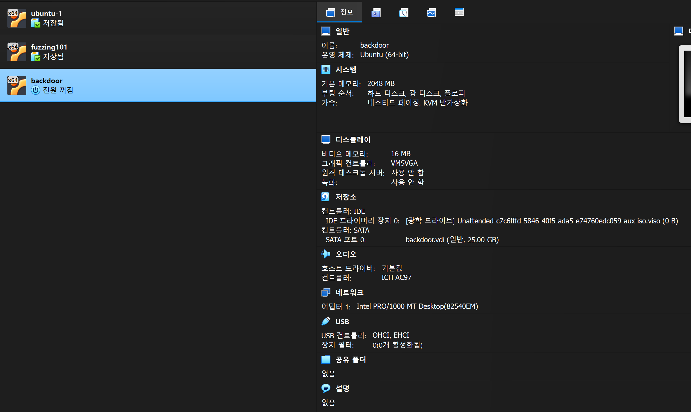
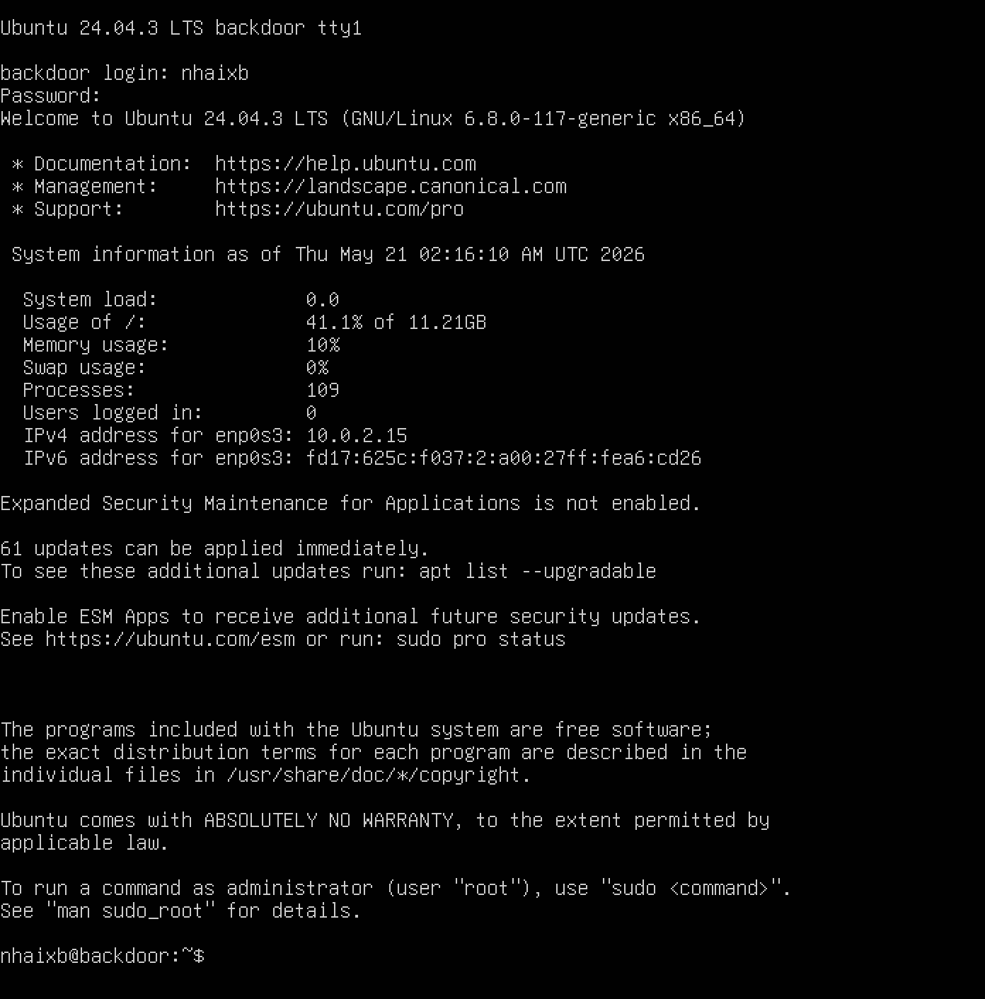

# 웹 보안 과제

### Dreamhack 워게임

## 📌 simple_sqli

### 1. 문제 정보

- 플랫폼: [Dreamhack](https://dreamhack.io/?utm_source=chatgpt.com)
- 분야: Web Hacking
- 유형: SQL Injection (Authentication Bypass)
- 난이도: Beginner

---

### 2. 문제 분석



→ 문제 파일을 열어보면 로그인 창이 뜬다.



→ 우선 문제를 분석하기 위해 아무 로그인 정보나 쳐서 결과를 확인해본다.



→ 플래그 값이 아니기 때문에 당연히 wrong이 뜬다.

### 3. 취약점 분석

문제 확인을 마쳤으니 웹을 구현하는 코드 구성을 뜯어 보았다.

[app.py](http://app.py) 파일을 받아 분석해보면 코드는 다음과 같다.

```
#!/usr/bin/python3
from flask import Flask, request, render_template, g
import sqlite3
import os
import binascii

app = Flask(__name__)
app.secret_key = os.urandom(32)

try:
    FLAG = open('./flag.txt', 'r').read()
except:
    FLAG = '[**FLAG**]'

DATABASE = "database.db"
if os.path.exists(DATABASE) == False:
    db = sqlite3.connect(DATABASE)
    db.execute('create table users(userid char(100), userpassword char(100));')
    db.execute(f'insert into users(userid, userpassword) values ("guest", "guest"), ("admin", "{binascii.hexlify(os.urandom(16)).decode("utf8")}");')
    db.commit()
    db.close()

def get_db():
    db = getattr(g, '_database', None)
    if db is None:
        db = g._database = sqlite3.connect(DATABASE)
    db.row_factory = sqlite3.Row
    return db

def query_db(query, one=True):
    cur = get_db().execute(query)
    rv = cur.fetchall()
    cur.close()
    return (rv[0] if rv else None) if one else rv

@app.teardown_appcontext
def close_connection(exception):
    db = getattr(g, '_database', None)
    if db is not None:
        db.close()

@app.route('/')
def index():
    return render_template('index.html')

@app.route('/login', methods=['GET', 'POST'])
def login():
    if request.method == 'GET':
        return render_template('login.html')
    else:
        userid = request.form.get('userid')
        userpassword = request.form.get('userpassword')
        res = query_db(f'select * from users where userid="{userid}" and userpassword="{userpassword}"')
        if res:
            userid = res[0]
            if userid == 'admin':
                return f'hello {userid} flag is {FLAG}'
            return f'<script>alert("hello {userid}");history.go(-1);</script>'
        return '<script>alert("wrong");history.go(-1);</script>'

app.run(host='0.0.0.0', port=8000)

```

나는 이 문제를 **Authentication Bypass형 SQLi, Login Bypass형 SQLi**라고 판단했다.

<aside>
💡

**SQL Injection**

*SQL: 관계형 데이터베이스 관리 시스템(DBMS)의 데이터를 관리하기 위해 설계한 특수 목적의 프로그래밍 언어

- 구조화된 질의 언어를 주입하는 공격
- 공격자가 입력 폼에 **악의적으로 조작된 쿼리**를 삽입해 **데이터베이스 정보를 불법적으로 열람**하거나 **조작할 수 있는 취약점**
- 대표 구문
    - 로그인 우회
    - Comment Injection
    - Blind SQL Injection
</aside>

<aside>
✅

**Authentication Bypass형(인증 우회) SQL Injection**

- 로그인창 등 인증 시스템의 입력값 검증 미흡을 이용해, SQL 쿼리의 논리 구조를 조작하여 ID/PW를 몰라도 관리자 또는 타인의 계정으로 우회 로그인하는 공격
- **Login Bypass형 SQLi(로그인 우회)**의 상위 개념
</aside>

#### 판단 근거:

**① 사용자 입력값의 검증 부재 및 동적 쿼리 생성**

```python
res = query_db(f'select * from users where userid="{userid}" and userpassword="{userpassword}"')
```

- **상세 분석:** 사용자가 로그인 폼에 입력한 `userid`와 `userpassword` 변수가 서버 측에서 어떠한 필터링이나 이스케이프(Escape) 처리 없이 파이썬 f-string을 통해 SQL 구문 내부에 동적으로 직접 결합된다
- **결과:** 이로 인해 공격자가 문자열을 감싸는 큰따옴표(`"`)를 깨고 나가 SQL 명령어 자체를 조작할 수 있는 환경이 조성된다

**② 단순 쿼리 결과(레코드 반환 여부) 기반의 인증 구조**

```python
res = query_db(...)
if res:
    userid = res[0]
```

- **상세 분석:** 본 서비스는 입력된 비밀번호가 DB에 저장된 비밀번호와 실제 일치하는지 해시 비교 등의 추가 알고리즘을 거치지 않고, 오직 **"SQL 쿼리 결과 데이터가 데이터베이스로부터 반환되었는가? (`if res:`)"** 라는 조건문 하나만으로 로그인 성공 여부를 판단한다
- **결과:** 따라서 아이디와 비밀번호를 몰라도 SQL 구조를 변형해 쿼리가 무조건 무언가(True)를 반환하도록 조작하면 시스템의 인증 체계가 완전히 속아 넘어가게 된다

**③ 주석 및 논리 연산자를 통한 인증 로직 무력화 가능성**

- **상세 분석:** 쿼리가 `WHERE userid="{userid}" AND userpassword="{userpassword}"` 형태로 묶여 있으므로, 데이터베이스(SQLite)의 문법적 특성을 이용해 뒤쪽의 패스워드 검증 로직을 완전히 무력화할 수 있다
- **공격 예시:**
    - `userid` 입력창에 `admin" --`를 주입할 경우, 뒤의 비밀번호 검증 쿼리가 SQL 주석(`-`)으로 처리되어 **아이디 일치 여부만으로 인증이 통과된다**
    - `userid` 입력창에 `admin" or "1"="1`을 주입할 경우, `OR` 연산자의 참(True) 효과로 인해 **패스워드가 틀리더라도 전체 WHERE 절이 참**이 된다
    

**④ 반환된 데이터 레코드 기반의 권한 인가 (결정적 근거)**

```python
if userid == 'admin':
    return f'hello {userid} flag is {FLAG}'
```

- **상세 분석:** 데이터베이스로부터 리턴받은 행(`res[0]`)의 계정명이 `admin`이기만 하면, 해당 세션에 최고 권한을 부여하고 민감한 데이터인 `FLAG`를 그대로 화면에 노출(인가)한다
- **결과:** 정상적인 자격 증명(비밀번호 검증) 없이 시스템을 기만하여 `admin` 권한을 탈취하므로, 이는 **인증 및 인가 우회(Authentication Bypass)** 취약점의 정의에 정확하게 부합한다

### 4. 공격 페이로드 및 실습 결과 (Payload)

```python
res = query_db(f'select * from users where userid="{userid}" and userpassword="{userpassword}"')
```

→ SQL 쿼리문에 사용자의 문자열 포맷팅을 그대로 삽입하는 코드로 구현되어 있어, SQL Injection이 쉽게 가능하다.





- **ID (`userid`) 입력값:** `*admin*`
- **PW (`userpassword`) 입력값:**  `*" or userid="admin*`
- **실제 데이터베이스에서 실행되는 조작된 쿼리:**
    
    ```python
    select * from users where userid="admin" and userpassword="" or userid="admin"
    ```
    
- **결과:** 뒤쪽의 패스워드 체크 부분이 주석으로 날아가 `admin` 계정 레코드가 반환되며 `hello admin flag is DH{...}`가 출력됨.

### 5. 대응 방안

```python
cur = get_db().execute('select * from users where userid=? and userpassword=?', (userid, userpassword))
res = cur.fetchone()
```

→ f-string을 사용한 동적 쿼리 생성을 중단하고, 아래와 같이 데이터베이스 엔진이 입력값을 순수 데이터로만 처리하도록 Prepared Statement(파라미터화 쿼리)를 적용해야 한다

### VirtualBox & 우분투 설치



