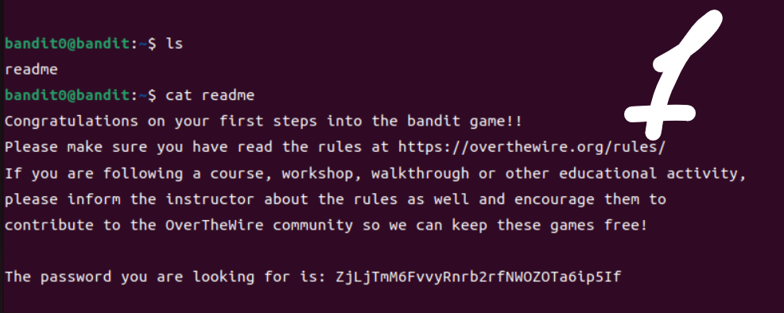
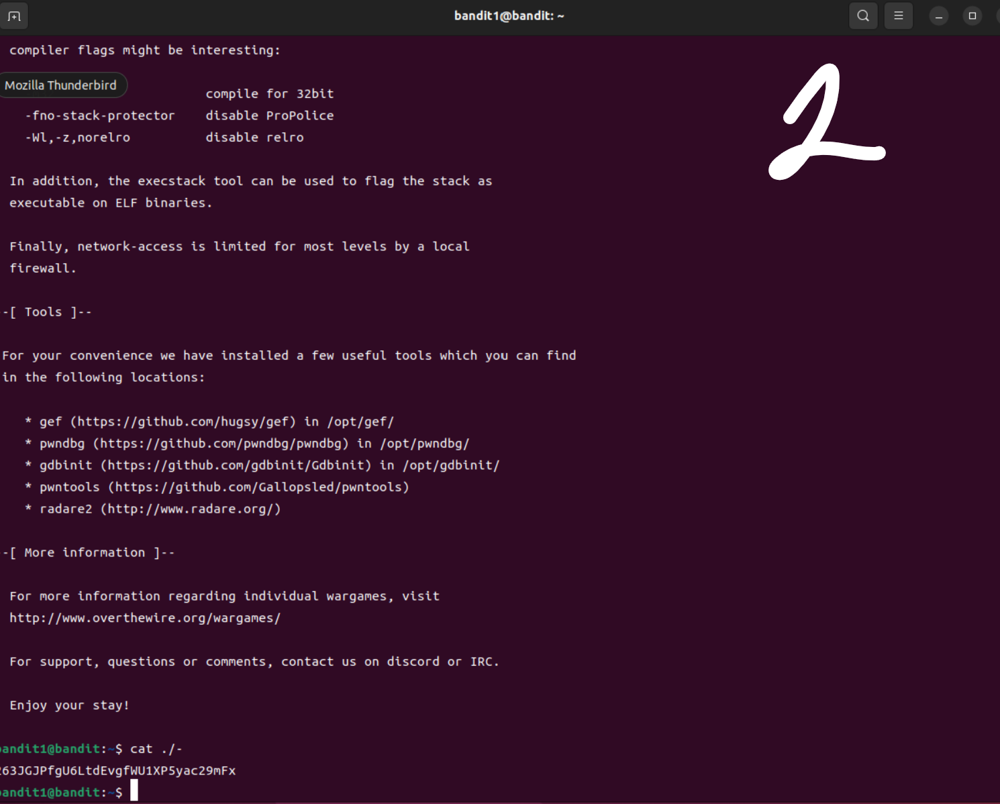
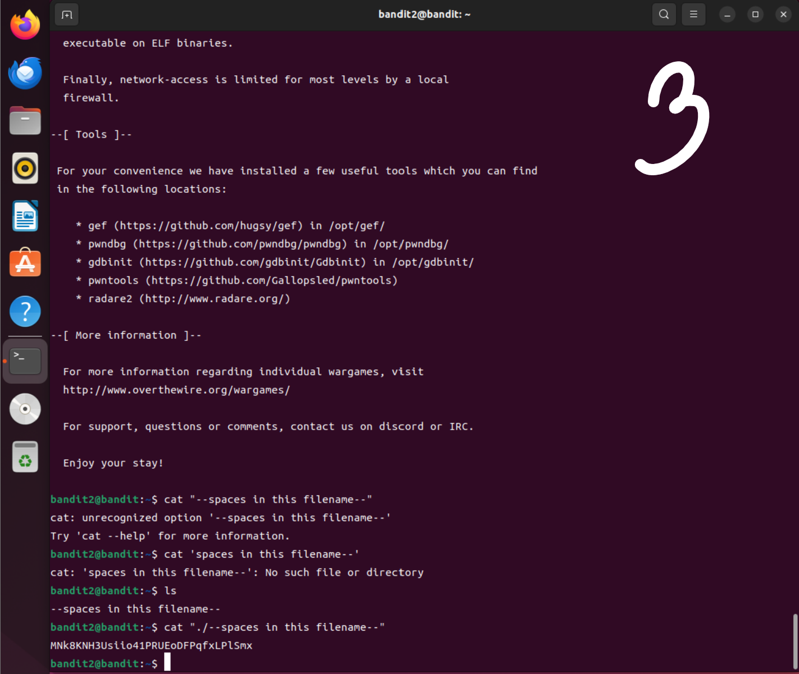
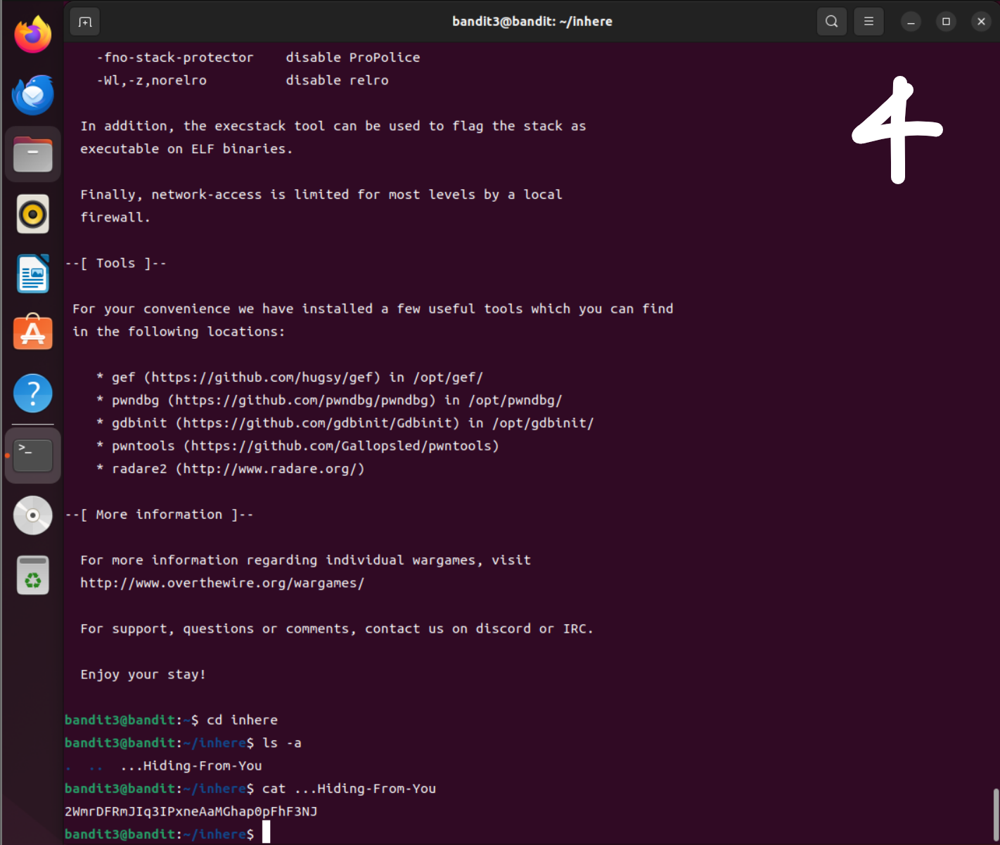
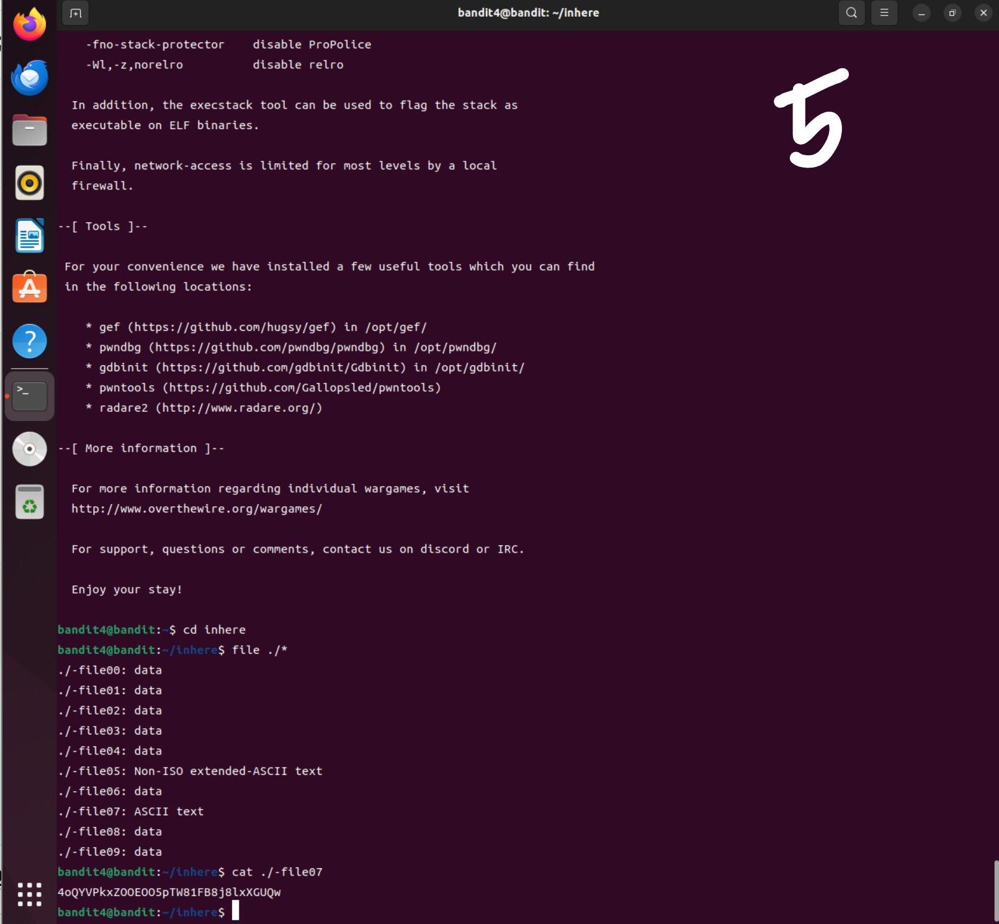

# week06 과제

## 사전 지식
<리눅스 명령어>

(1) 디렉터리 관련 명령어

pwd : 현재 작업 디렉터리 확인

cd : 작업 디렉터리 변경(v)

ls : 디렉터리 내용 목록 출력(v)

(2) 파일 관련 명령어

cat : 텍스트 파일 내용 출력(v)

(3) 파일 검색 명령어

find : 조건에 맞는 파일 검색 ex. find [검색 위치] [-검색조건] [-동작]

grep : 파일 내용에서 패턴 검색 ex. grep [-옵션] [패턴] [파일이름]

## Level 0→1 // ssh -p 2220 bandit0@bandit.labs.overthewire.org
Q. The password for the next level is stored in a file called readme located in the home directory. Use this password to log into bandit1 using SSH.

홈 디렉터리에 있는 readme 파일의 내용을 읽어야 한다. ls로 현재 디렉터리의 파일 확인하면 readme 파일이 보인다. cat readme로 파일 내용을 읽는다. 

## Level 1→2 // ssh -p 2220 bandit1@bandit.labs.overthewire.org
Q. The password for the next level is stored in a file called - located in the home directory.

홈 디렉터리에 - 라는 이름의 파일의 내용을 읽어야 한다. 하지만 1번 문제와 같이 cat - 라고 쓰면 - 를 표준 입력의 의미로 해석하기 때문에, - 가 파일 이름이라는 것을 명시해야 한다. ./- 는 현재 디렉터리에 있는 이름이 - 인 파일이라는 의미이므로 cat ./- 와 같이 명령어를 입력한다. 

## Level 2→3 // ssh -p 2220 bandit2@bandit.labs.overthewire.org
Q. The password for the next level is stored in a file called --spaces in this filename-- located in the home directory.

먼저 ls 명령어를 통해 홈 디렉터리에 --spaces in this filename--가 있는지 확인한다. 리눅스에서는 공백이 명령어 구분으로 사용되기 때문에 파일 이름에 공백이 포함된다면 파일 이름 전체를 하나로 묶어줘야 한다. cat "./--spaces in this filename--" 와 같이 파일의 이름을 큰 따옴표나 작은 따옴표로 감싸서 명령어를 입력한다. 이때 단순히 cat "--spaces in this filename--"나 cat '--spaces in this filename--'이 아니라 cat "./--spaces in this filename--"로 하면 옵션으로 혼동되지 않아 명확하다. 

## Level 3→4 // ssh -p 2220 bandit3@bandit.labs.overthewire.org
Q. The password for the next level is stored in a hidden file in the inhere directory.

inhere 디렉터리의 숨김 파일을 찾아야 하기 때문에 cd inhere을 통해 inhere 디렉터리로 이동한다. 숨김 파일까지 포함해서 보기 위하여 ls -a을 입력하면, 숨김 파일의 이름을 알 수 있다. 보통 리눅스에서 숨김 파일은 이름이 . 으로 시작한다. cat ...Hiding-From-You(찾은 숨김 파일의 이름)를 입력한다. 

## Level 4→5 // ssh -p 2220 bandit4@bandit.labs.overthewire.org
Q. The password for the next level is stored in the only human-readable file in the inhere directory. 

inhere 디렉터리 안에 있는 여러 파일 중 사람이 읽을 수 있는 내용의 파일을 찾아야 한다. 먼저 cd inhere을 통해 inhere 디렉터리로 이동한다. 리눅스의 file 명령은 파일 종류를 확인하는 명령어이고, ./* 는 현재 디렉터리의 모든 파일을 의미한다. 예를 들어 file readme 라고 입력한 결과가 readme: ASCII text로 출력된다면 ASCII text가 파일의 종류를 의미하며 이는 사람이 읽을 수 있는 일반 텍스트 파일로 cat 명령어를 사용하면 글자가 보이는 파일이다. 따라서 file ./* 을 통해 파일 종류를 확인한다. 그 중 ./-file07: ASCII text가 사람이 읽을 수 있는 내용의 파일이므로, cat ./-file07 을 입력한다.
 
