# 리눅스 기초 과제

## Bandit Wargame

*Linux 명령어와 터미널 환경에 익숙해지기 위한 입문용 워게임*

## 사전 지식

### 1. SSH (Secure Shell) 원격 접속

Bandit의 모든 레벨은 웹 브라우저가 아니라, 터미널에서 주최 측 서버로 원격 접속을 하면서 시작됨.

- **핵심 개념:** 네트워크 상의 다른 컴퓨터에 안전하게 로그인하기 위한 프로토콜.
- **기본 구조:** `ssh 사용자계정@호스트주소 -p 포트번호`
- **Bandit 접속 예시:** `ssh bandit0@bandit.labs.overthewire.org -p 2220` (Bandit은 기본 SSH 포트인 22번 대신 2220번 포트를 사용함)

### 2. 리눅스 파일 시스템과 기본 명령어

| **분류** | **필수 명령어** | **역할** |
| --- | --- | --- |
| **위치 파악** | `pwd`, `ls`, `cd` | 현재 경로 확인, 파일 목록 보기, 디렉토리 이동 |
| **파일 읽기** | `cat`, `head`, `tail`, `less` | 텍스트 파일의 내용 출력 및 부분 확인 |
| **파일 찾기** | `find`, `locate` | 특정 조건(크기, 소유자 등)에 맞는 파일 검색 |
| **문자열 찾기** | `grep`, `strings` | 파일 내부에서 특정 텍스트 패턴(문자열) 검색 |

### 3. 파일 권한과 소유자

- **확인 방법:** `ls -l`을 입력했을 때 맨 앞에 나오는 `drwxr-xr-x` 같은 기호를 통해 알 수 있음. (Read, Write, eXecute)
- **특수 권한:** 파일 실행 시 소유자의 권한을 빌려오는 **SetUID(SUID)** 개념이 후반부 핵심 원리로 등장함.

### Level 0

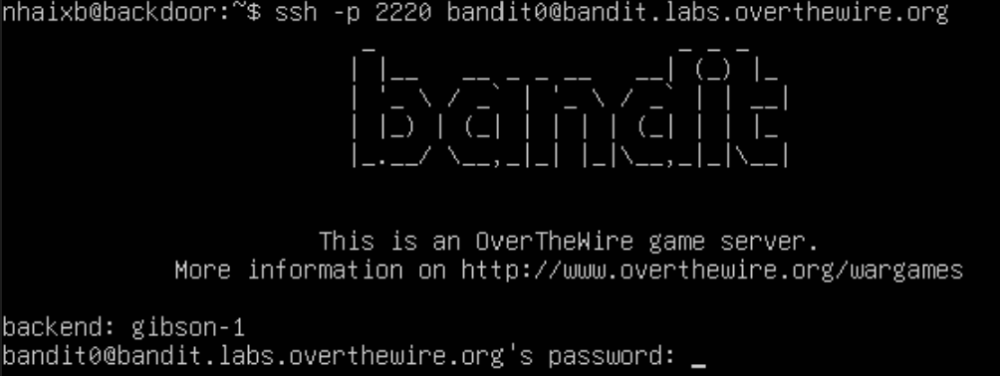

→ `ssh -p 2220 [bandit0@bandit.labs.overthewire.org](mailto:bandit0@bandit.labs.overthewire.org)` 에 접속

- 이미 홈페이지에 level 0의 password를 bandit0으로 알려주었기 때문에 어렵지 않게 작성할 수 있다.

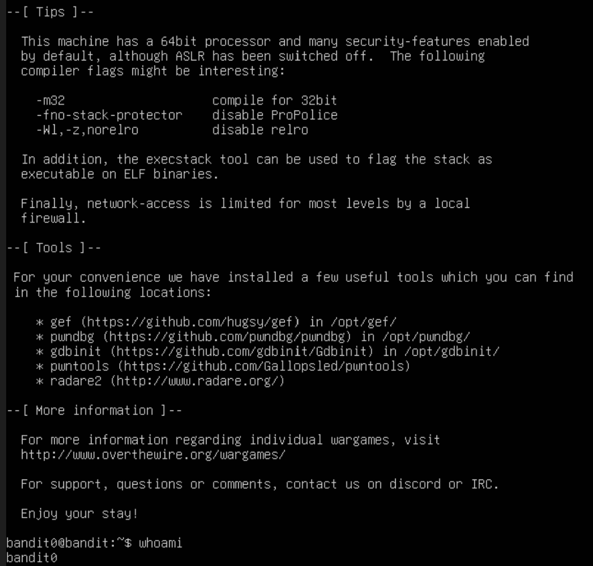

→ 비밀번호를 입력하고 나면 bandit0@bandit 계정으로 로그인된 것을 확인할 수 있다.

### Level 1

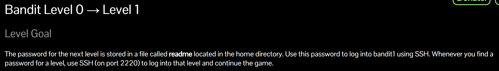

→ Level 1의 계정에 로그인하기 위한 패스워드가 readme 디렉토리 안에 숨겨져 있다.

→ ls 명령어를 통해 현재 bandit0 계정의 하위 디렉토리에 readme가 있는지를 확인했다.

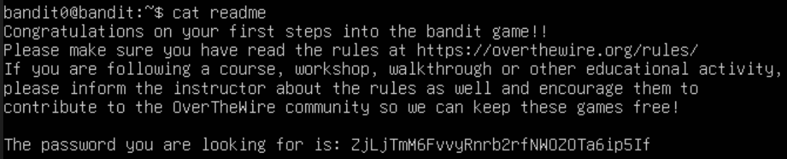

→ readme 디렉토리가 있는 것을 확인했으니, 해당 디렉토리 안에 존재하는 내용을 불러오고자 `cat` 명령어를 사용했다. 숨겨져있던 비밀번호는 `ZjLjTmM6FvvyRnrb2rfNWOZOTa6ip5If` 인 것을 알 수 있다.

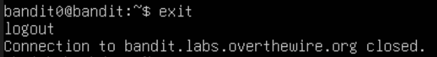

→ 다음 레벨로 넘어가기 위해 기존에 로그인 되어있던 bandit0 계정에서 `exit` 명령어를 통해 로그아웃하고, `ssh -p 2220 bandit1@bandit.labs.overthewire.org`로 로그인 시도를 해보았다.

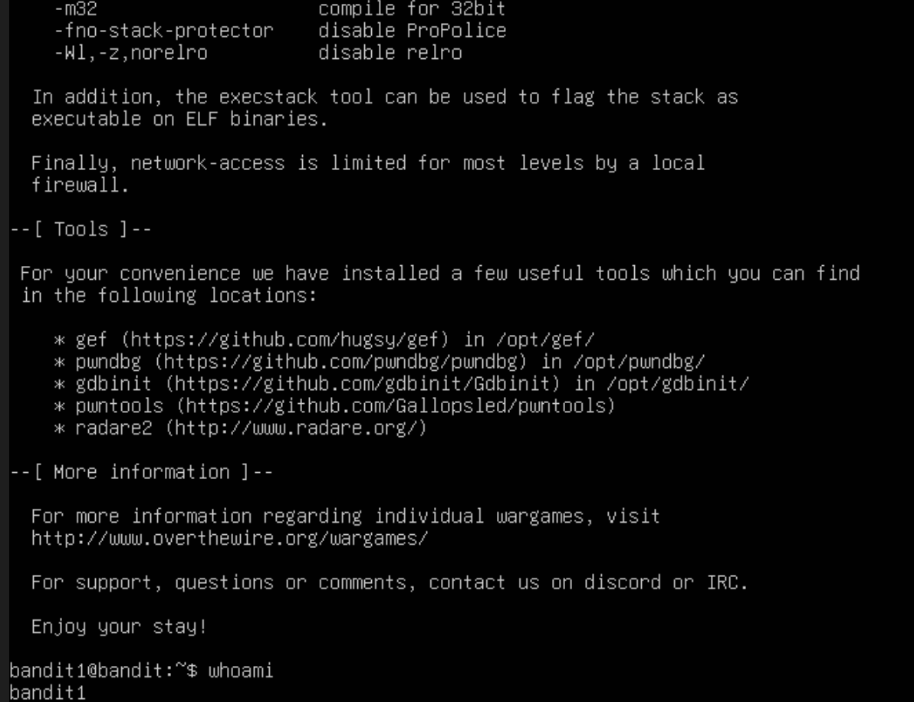

→ Level 0에서 얻었던 비밀번호인 `ZjLjTmM6FvvyRnrb2rfNWOZOTa6ip5If` 를 password에 작성하면 bandit1 계정에 로그인이 되는 것을 볼 수 있다.

### Level 2

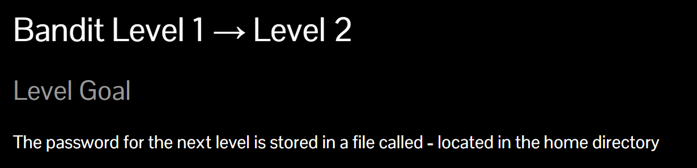

→ Level 1에서 Level 2로 넘어갈 수 있는 비밀번호는 home 디렉토리 안에 있는 - 라는 파일안에 숨겨져 있다고 한다.

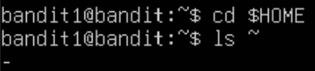

→ `cd $HOME` 명령어를 통해 절대 경로로 홈 디렉토리로 이동한 뒤, `ls` 명령어를 통해 해당 디렉토리의 하위 파일 목록을 살펴보았다. 역시, - 라는 이름의 파일이 존재했다.

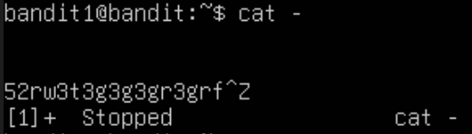

→ 앞선 문제와 같은 방식으로 `cat` 명령어를 통해 - 파일을 열어보려했으나, 아무 값도 뜨지 않고 내가 작성하는 값만 그대로 출력되었다. `Ctrl+Z` 키를 통해 일단 탈출했다.

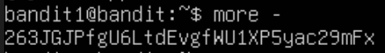

→ `more -` 명령어를 쳤을 땐 잘 읽힌다. 

- `more` : 출력되는 데이터 값이 많을 때 한 페이지씩 나눠 한 번에 볼 수 있도록 하는 명령어

<aside>
💡

**`cat -` 가 안 읽히는 이유:**

- - (하이픈)은  기본적으로 명령어의 옵션을 지정하거나 표준 입력을 뜻하는 명령으로 해석된다.
- cat 다음에 바로 - 가 오면, - 를 파일 이름으로 해석하는게 아니라 "사용자가 키보드로 타이핑하는 내용(표준 입력)을 그대로 받아서 출력해라"라고 이해한다.
- 이 문제를 해결하려면 `cat` 명령어에 "이것은 옵션이나 표준 입력 기호가 아니라, 진짜 파일의 이름이다"라는 것을 알려주어야 한다.
</aside>

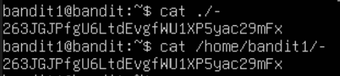

→ `cat -` 를 읽을 수 있도록 해결하는 방법은 `cat ./-`로 상대 경로를 지정하는 것과, `/home/bandit1/-`로 절대 경로를 지정하는 것, 총 두 가지로 나뉜다. Level 1 에서 찾아낸 다음 패스워드는 `263JGjPfgU6LtdEvgfWU1XP5yac29mFx` 임을 알 수 있다.

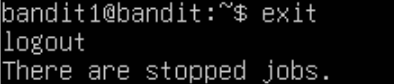

→ bandit1 계정에서 로그아웃한 뒤, `ssh -p 2220 bandit2@bandit.labs.overthewire.org`로 접속해 획득한 패스워드를 입력하고자 하였다.

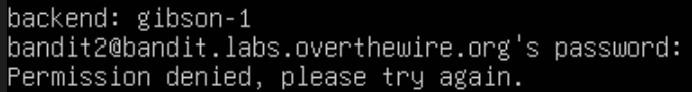

→ 다만, 왜인지는 모르겠지만 올바른 답을 입력하였음에도 계속해서 permission denied 오류가 떠 Windows cmd 창으로 이동해 계속 진행했다.

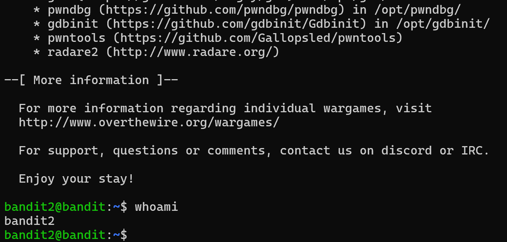

→ 다행히도 cmd 창에서는 잘 접속이 되는 것을 확인할 수 있다.

### Level 3

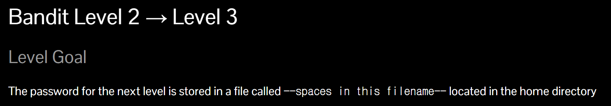

→ 다음 레벨로 넘어가기 위해 획득할 패스워드는 홈 디렉토리 안에 있는 —spaces in this filename— 이라는 파일 안에 숨겨져 있다.

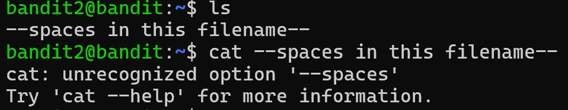

→ `ls` 명령어를 통해 해당 파일이 있는 것을 확인했으며, 역시 `cat` 명령어를 통해서는 해결되지 않는 것을 확인할 수 있다.

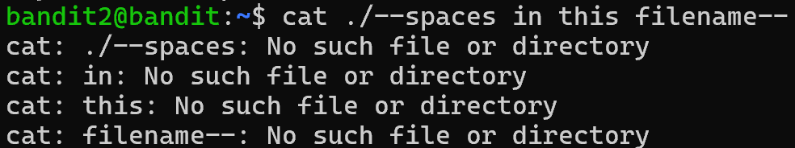

→ 앞서 해결했던 방법인 상대 경로 지정 방법을 활용해보니, 이번에도 해결되지 않는 것을 확인할 수 있다. 에러문을 봤을 때, spaces, in, this, filename을 각각 뜯어 총 4 개의 파일로 해석한 것 같다. 

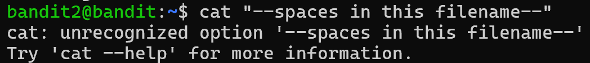

→ 여타 언어처럼 “ ” 로 한 단위로 묶어보았으나, 이 역시 해결되지 않는 것을 확인할 수 있다.

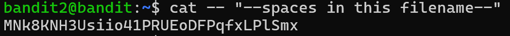

→ 이 문제를 해결하기 위해서는 — (더블 하이픈)을 작성해주는 것이 필요하다. 

<aside>
💡

**`—` (End of Options, 더블 하이픈)**

명령어 뒤에 띄어쓰기를 하고 `--`를 단독으로 적어주면, 리눅스에게 다음과 같은 아주 강력한 선언을 하는 것과 같다.

→ "지금부터 이 뒤에 나오는 모든 글자는 절대로 '옵션'으로 취급하지 마라. 무조건 '파일 이름'이나 '입력값'으로만 받아들여라.”

</aside>

이렇게 강한 명령을 내리면 앞선 오류와 같이 하나의 파일 이름을 여러개의 파일로 헷갈릴 수 있는 가능성이 사라지기 때문에, 다음 레벨로 가기 위한 패스워드는 `MNk8KNH3Usiio41PRUEoDFPqfxLPlSmx` 임을 확인할 수 있다.

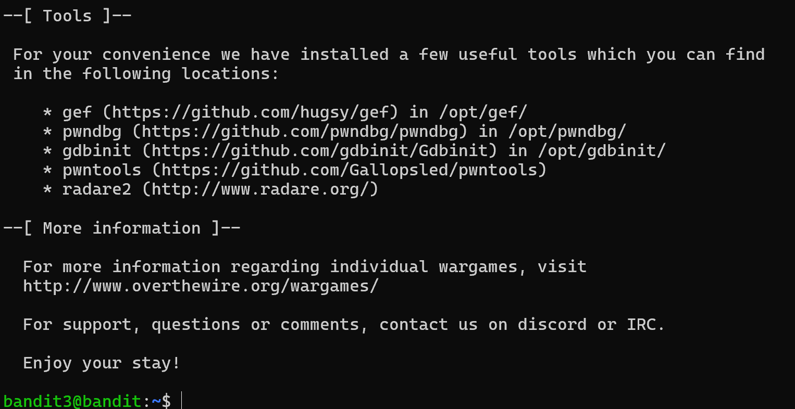

→ bandit3 계정에 잘 로그인한 것을 확인할 수 있다.

### Level 4

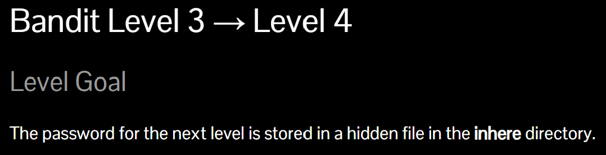

→ 다음 레벨로 넘어가기 위해 필요한 패스워드는 inhere 디렉토리 안의 숨겨진 파일 내에 숨겨져 있다.

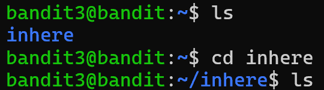

→ `ls` 명령어를 통해 inhere 디렉토리가 존재함을 확인했으며, `cd inhere`명령어를 통해 해당 디렉토리 내로 이동했다. 그 후, 또 다시 ls 명령어를 통해 inhere 디렉토리 내에 존재하는 파일들을 찾아내고자 하였으나 아무것도 뜨지 않음을 통해 숨겨진 파일이 존재함을 알 수 있다.

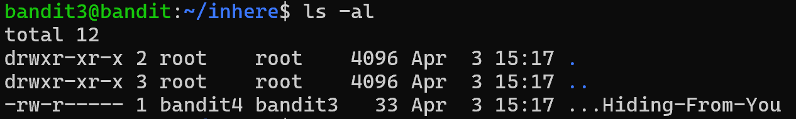

→ 숨겨진 모든 파일들의 정보를 볼 수 있는 ls -al 명령어를 통해 …Hiding-From-You 파일이 존재함을 확인할 수 있다. 

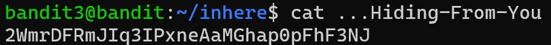

→ cat 명령어를 통해 숨겨진 파일 내의 패스워드, `2WmrDFRmJIq3IPxneAaMGhap0pFhF3NJ`를 획득하였다. 

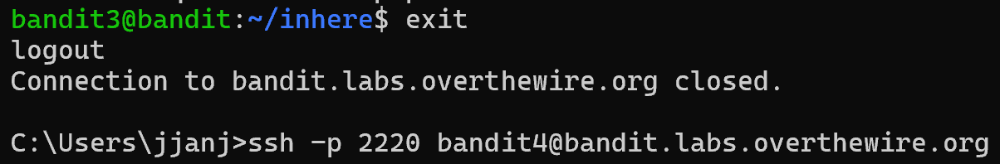

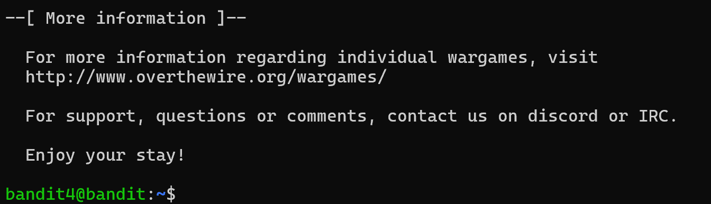

→ 다음 단계로 넘어가기 위해 exit 명령어를 통해 로그아웃을 하고, `ssh -p 2220 bandit4@bandit.labs.overthewire.org`로 접속해 패스워드를 확인했다. 결과적으로 bandit4 계정에 잘 로그인한 것을 확인할 수 있다.

### Level 5

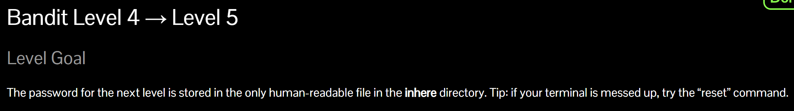

→ 다음 문제로 넘어가기 위해서 획득해야 하는 패스워드는 inhere 디렉토리 안에 존재하는 only human-readable 파일 내에 존재한다. 터미널이 더러워지면? `reset` 명령어로 정리하라고 한다. only human-readable 파일이 정말 파일 이름인건지, 아니면 실제로 사람만 읽을 수 있는 파일인건지 아직 모르겠다.

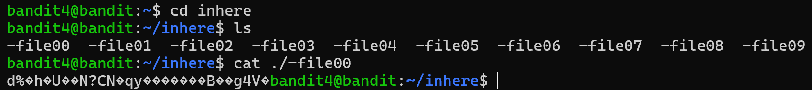

→ `cd inhere` 명령어로 해당 디렉토리로 이동한 뒤, ls 명령어를 통해 존재하는 파일들을 확인했다. 파일이 꽤 많아 우선적으로 가장 앞에 있는 -file00 파일부터 열어봤는데, 사람으로선 알 수 없는 바이너리 데이터가 출력되었다. 이로써 only human-readable 파일은 실제로 사람만 읽을 수 있는 데이터 값을 가진 파일을 찾아 패스워드를 획득하라는 문제임을 추론할 수 있다.

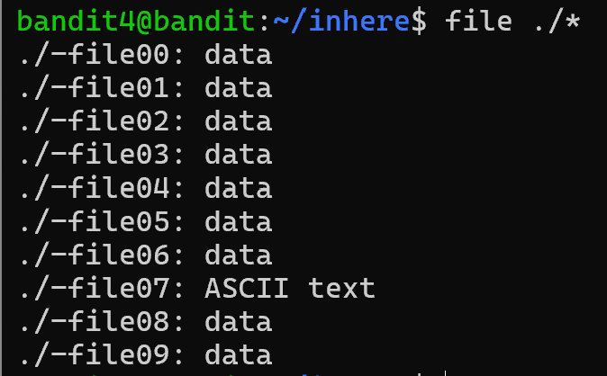

→ 그렇다면 분명 다른 데이터 값을 가진 파일이 존재한다고 역추론할 수 있다. 모든 파일의 데이터 형태를 알 수 있는 명령어인 `file ./*`를 입력해 각각의 파일이 지니는 데이터의 형태를 살펴봤다. 이에, -file07 파일이 아스키 코드로 이루어진 텍스트 타입임을 확인하였다.

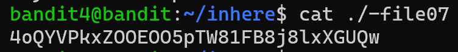

→ -file07 파일을 열어 확인을 해보니 역시 사람만 읽을 수 있는, 텍스트 데이터값을 지닌 패스워드였다. 이제 패스워드를 확인을 했으니 다음 레벨로 넘어가보자.

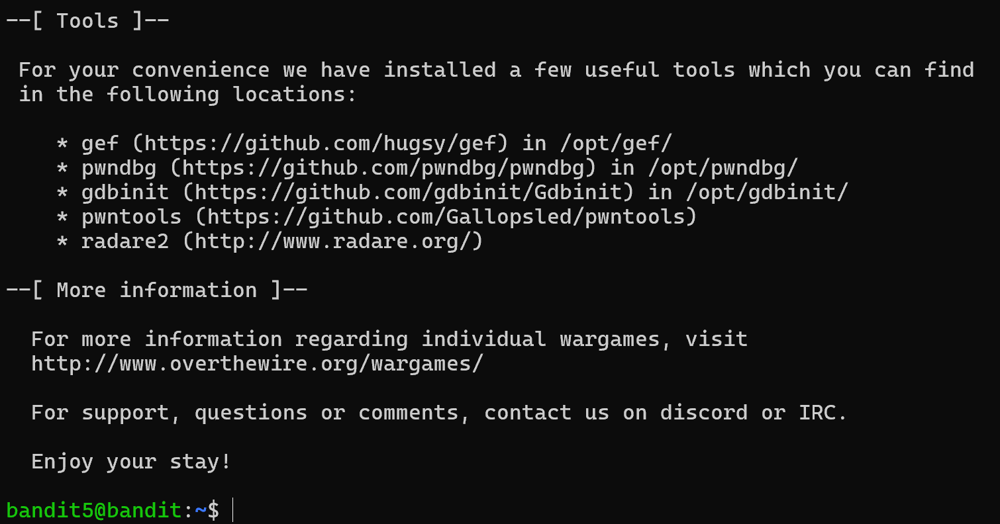

→ `ssh -p 2220 bandit5@bandit.labs.overthewire.org`로 접속 후 취득한 패스워드를 입력하면 정상적으로 bandit5 계정에 로그인한 것을 확인할 수 있다.