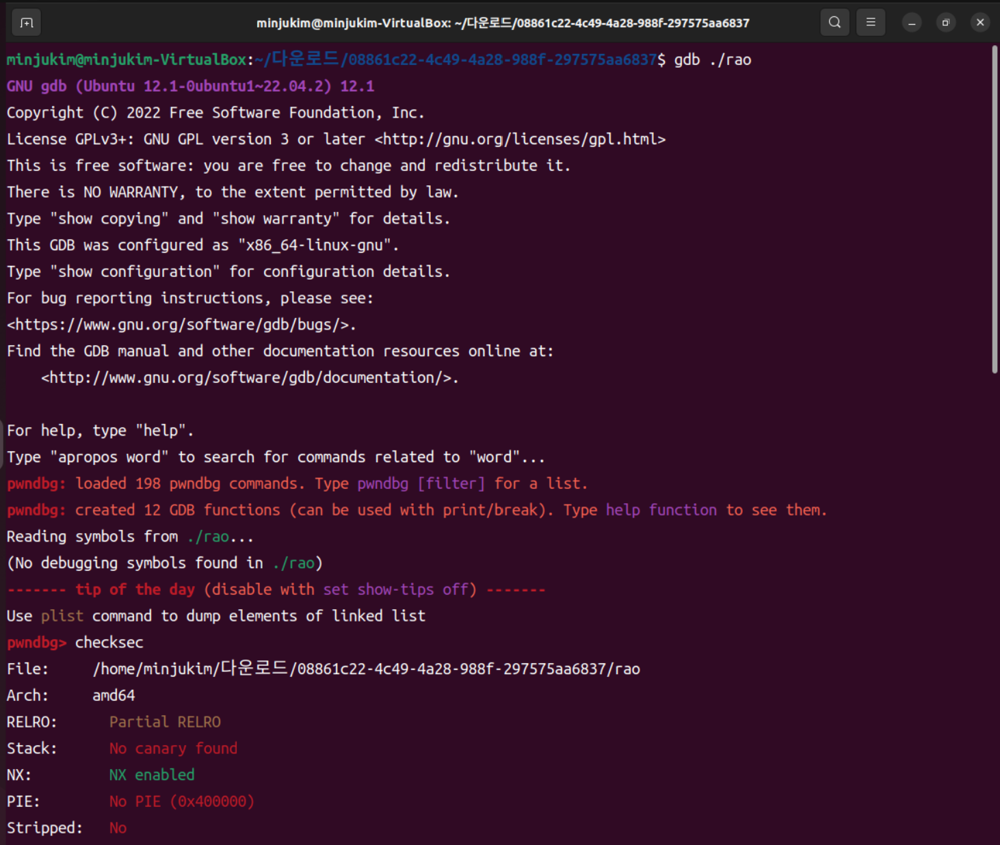
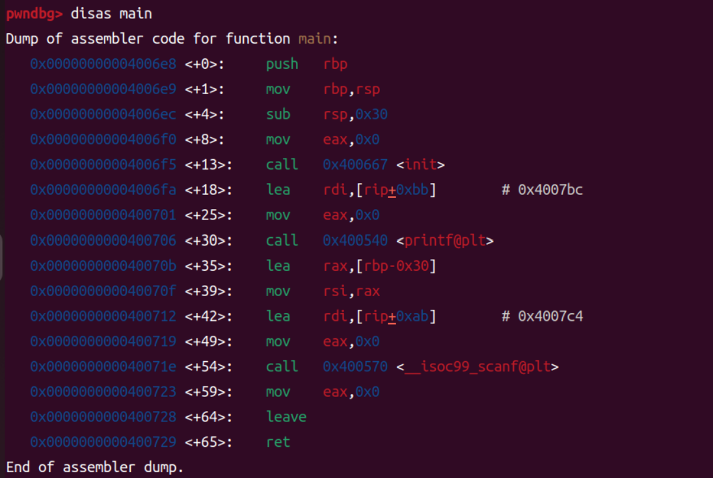
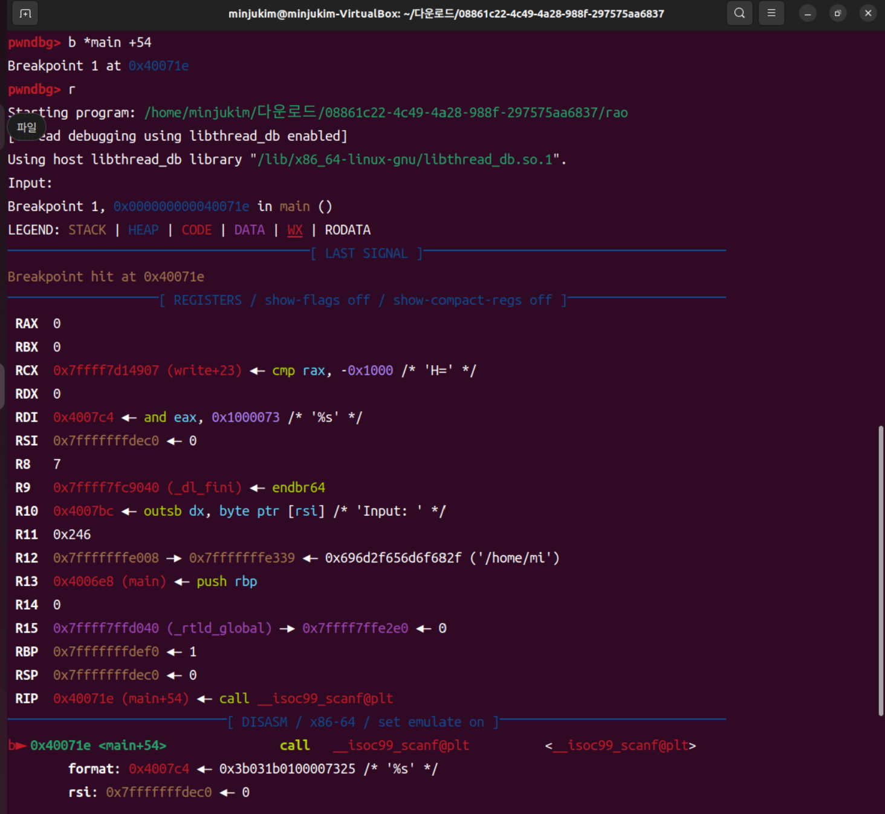
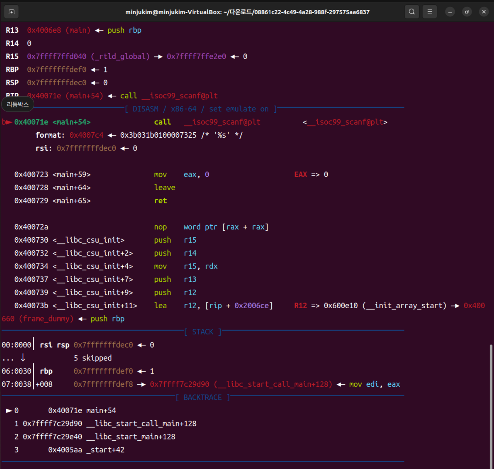
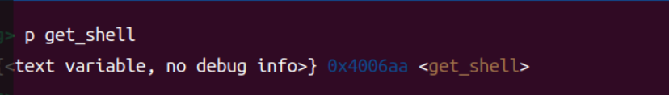
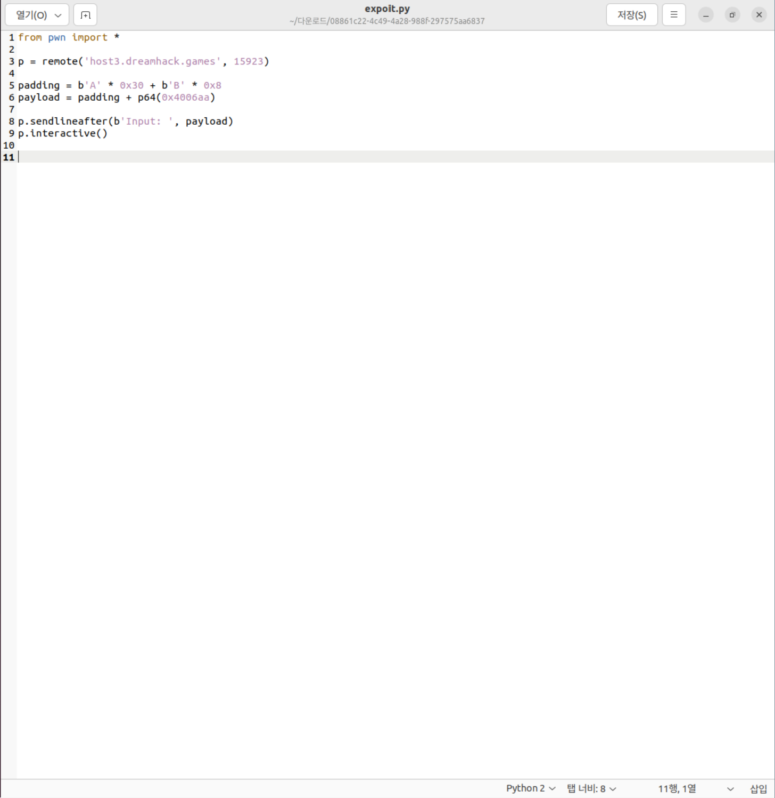
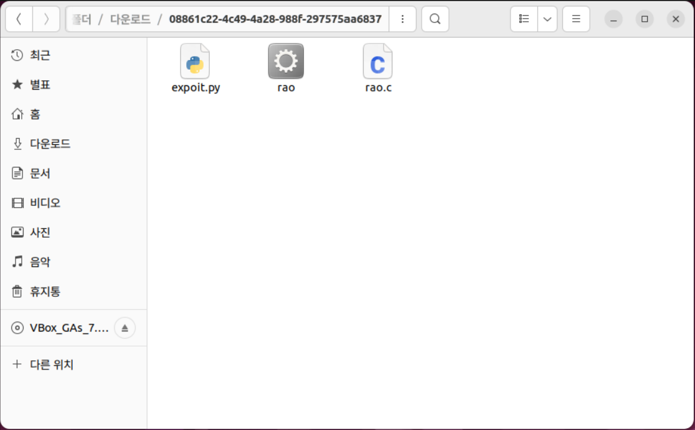
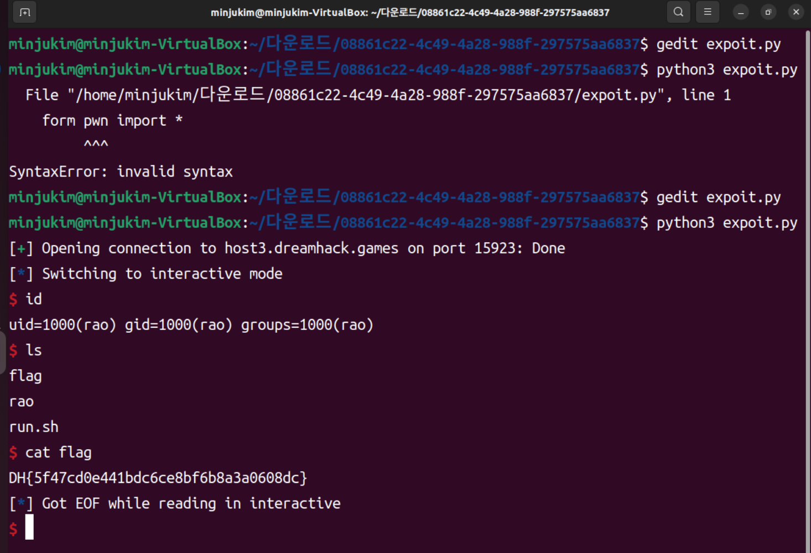

# week07 과제

## rao.c
// Name: rao.c
// Compile: gcc -o rao rao.c -fno-stack-protector -no-pie

#include <stdio.h>
#include <unistd.h>

void init() {
  setvbuf(stdin, 0, 2, 0);
  setvbuf(stdout, 0, 2, 0);
}

void get_shell() {
  char *cmd = "/bin/sh";
  char *args[] = {cmd, NULL};

  execve(cmd, args, NULL);
}

int main() {
  char buf[0x28];

  init();

  printf("Input: ");
  scanf("%s", buf);

  return 0;
}

## 취약한 부분
char buf[0x28];
scanf("%s", buf);

## 보호기법 확인
gbd ./rao 입력 후 pwndbg에서 checksec 로 보호 기법을 확인할 수 있다. No canary found, No PIE 이므로 버퍼 오버플로우에서 함수의 반환 주소를 덮어쓰는 공격을 할 수 있다.  

## PWNDBG 분석
disas main 을 입력하면 0x40070b <main+35>: lea   rax, [rbp-0x30] 에서 buf의 시작 주소가 rbp-0x30임을 확인할 수 있다. 

## b와 r로 브레이크포인트 설정 후 실행
offset은 버퍼 시작부터 저장된 RIP가 시작되는 위치까지의 거리를 의미한다. 

RSI  0x7fffffffdec0
RBP  0x7fffffffdef0 
RSP  0x7fffffffdec0

RSI(버퍼 시작)에서 RBP까지의 거리는 0x7fffffffdef0 - 0x7fffffffdec0 = 0x30 와 같다. 버퍼 영역은 0x7fffffffdec0 ~ 0x7fffffffdee 까지이고, 그 크기가 48바이트이다. 그 다음 주소인 0x7fffffffdef0 부터 저장된 RBP 8바이트가 들어 있다. 이를 더하면 offset = 0x30 + 0x08 = 0x38 = 56바이트이다. 즉, 버퍼와 저장된 RBP를 덮기 위한 패딩이 56바이트이므로 payload = b"A"*56 + p64(RIP에 덮어쓸 값) 로 구성하면 된다. 이렇게 하면 패딩 다음 8바이트가 저장된 RIP에 기록된다. 

## get_shell 주소 확인
$1 = {<text variable, no debug info>} 0x4006aa <get_shell>에서 0x4006aa임을 알 수 있다. 

## 익스플로잇 코드 작성
padding = b'A' * 0x30 + b'B' * 0x8; payload = padding + p64(0x4006aa)과 같이 구성한다. 

## 플래그 획득하기
ls 를 입력해서 파일 목록을 확인 후 cat flag로 플래그를 얻는다. 

